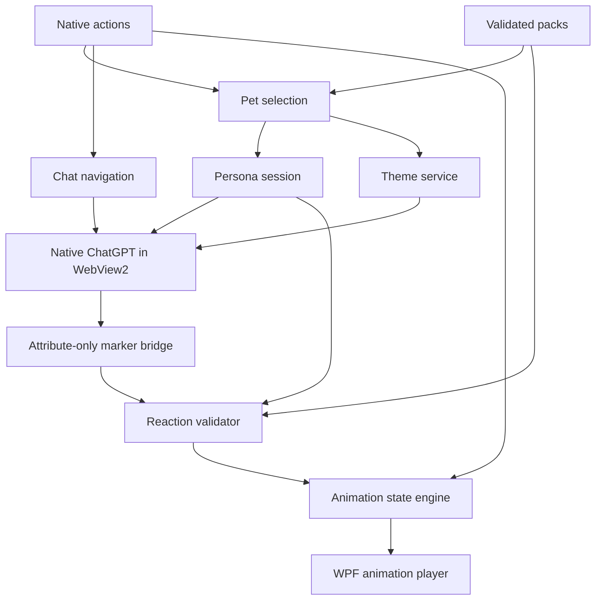

# PetGPT v2 — architecture proposal

Date: 2026-09-17. Status: **design for review; no application changes implemented**.

Repository baseline: [Navdra12/Petgpt, commit c0c478877257118be849d751e2a8ee60c78e6ba4](https://github.com/Navdra12/Petgpt/tree/c0c478877257118be849d751e2a8ee60c78e6ba4), the only commit returned for `main` during this review. All **20 text files** were read, along with the complete, untruncated repository tree and branch/commit metadata. The one PNG was inventoried, not visually reviewed. This was a source assessment, not a Windows build or an authenticated inspection of ChatGPT's current DOM.

Companion documents: [implementation plan](../plans/2026-09-17-petgpt-v2.md) and [Codex handoff](../handoffs/2026-09-17-petgpt-v2-codex.md). The English specification follows the supplied task and is intended to travel with the implementation plan.

## Decision summary

Keep the existing WPF application, windows, persistent WebView2 profile, and native ChatGPT UI. Introduce small components within the same application project. Character packs contain **data and assets**, not executable plugins. The model chooses a character-specific reaction; PetGPT validates that identifier and selects a local animation.

Use shared PetChats instructions plus a **visible per-chat persona activation message** assembled from the selected pack. A local pet switch updates the intended persona immediately, but the application must distinguish that intention from instructions actually submitted to ChatGPT.

Prefer a reaction encoded in the `href` of a reserved Markdown link. This permits an attribute-only bridge without reading answer text. Its rendering and the current page's structural selectors are an **early feasibility gate**, not an assumed supported ChatGPT API. If this gate fails, deliver packs, tray, navigation, themes, and system animations with model reactions disabled; do not expand into response scraping.

### Alternatives considered

| Approach | Benefits | Costs | Decision |
|---|---|---|---|
| Incremental WPF components, data packs, one native web surface | Preserves MVP behavior and sessions; narrow maintenance surface | Some capabilities depend on a small DOM adapter | **Recommended** |
| One ChatGPT project or custom GPT per character | Can keep a character's instructions in a dedicated remote context | Conflicts with the shared PetChats workflow; more manual setup; switching is still not a local-file operation | Optional user practice, not the core design |
| API conversation engine, duplicate chat UI, or Electron rewrite | More control over transport and rendering | Violates the product constraints or adds substantial migration/operational cost | Excluded |

## 1. Current repository assessment

| Existing file or area | Observed implementation | Preserve or evolve |
|---|---|---|
| `PetGPT.csproj` | Root application project; `net8.0-windows`, WPF, nullable/implicit usings; WebView2 NuGet `1.0.4191.47`; three explicit content copies | Keep project location and baseline dependency initially |
| `App.xaml`, `App.xaml.cs` | Creates `SettingsService` and `PetWindow`; shutdown follows main-window closure | Make the app own lifetime when tray support arrives |
| `Windows/PetWindow.xaml` | 150×150 transparent, topmost, taskbar-hidden window; one PNG; Open/Hide and Exit context menu | Keep the window and interaction model; replace image source with a player |
| `Windows/PetWindow.xaml.cs` | Owns settings, drag recognition, bubble construction, toggling, repositioning, saving, exit | Move application concerns out; retain pointer/capture handling in the view |
| `Windows/ChatBubbleWindow.xaml` | Topmost taskbar-hidden WebView2 window; 500×650 default, minimum 360×420; browser/reload/close buttons | Keep native ChatGPT and these actions |
| `Windows/ChatBubbleWindow.xaml.cs` | Lazy browser initialization; close/Escape hide; resize updates in-memory settings; browser button always opens the root URL | Add a thin controller-facing surface and explicit disposal |
| `Services/ChatWebViewService.cs` | Creates persistent environment at `%LOCALAPPDATA%\PetGPT\WebView2`; navigates to root; injects CSS/JS after successful navigation | Retain this service as browser lifecycle owner; extract navigation/theme/bridge responsibilities |
| `Services/SettingsService.cs` | Reads/writes unversioned JSON; load/save errors swallowed; direct synchronous overwrite | Introduce validation, migration, atomic writes, debounce, bounded diagnostics |
| `Services/WindowPositionService.cs` | Uses primary `SystemParameters.WorkArea`; bubble follows pet above/below | Add monitor-aware geometry and explicit pixel/DIP boundaries |
| `Web/compact-chatgpt.css` | Hides every `aside`; removes horizontal overflow; widens `main` | Narrow selectors; keep history accessible |
| `Web/compact-chatgpt.js` | Empty reserved extension point | Replace with a small app-owned adapter, not a pack scripting surface |
| `Models/AppSettings.cs` | `PetLeft`, `PetTop`, `BubbleWidth`, `BubbleHeight`, `CompactMode` | Exact migration source |
| Documentation and tooling | Short agent guide and product/decision/state docs; no tests, CI workflow, solution file, pack loader, tray, animation engine, or bridge | Add only the structure needed by the new subsystems |

Evidence: [project](https://github.com/Navdra12/Petgpt/blob/c0c478877257118be849d751e2a8ee60c78e6ba4/PetGPT.csproj), [pet window](https://github.com/Navdra12/Petgpt/blob/c0c478877257118be849d751e2a8ee60c78e6ba4/Windows/PetWindow.xaml.cs), [chat window](https://github.com/Navdra12/Petgpt/blob/c0c478877257118be849d751e2a8ee60c78e6ba4/Windows/ChatBubbleWindow.xaml.cs), [browser service](https://github.com/Navdra12/Petgpt/blob/c0c478877257118be849d751e2a8ee60c78e6ba4/Services/ChatWebViewService.cs).

The README still describes Windows verification as outstanding, whereas `docs/current-state.md` records a successful restore/build, responsive launch, login, drag, and Exit verification. Treat that as **recorded MVP verification**, and repair the stale README in the first implementation slice. No new runtime verification was performed for this proposal. [README](https://github.com/Navdra12/Petgpt/blob/c0c478877257118be849d751e2a8ee60c78e6ba4/README.md), [current state](https://github.com/Navdra12/Petgpt/blob/c0c478877257118be849d751e2a8ee60c78e6ba4/docs/current-state.md).

## 2. Technical debt relevant to the expansion

| Finding from source | Consequence | Planned treatment |
|---|---|---|
| Drag uses `PointToScreen` deltas directly in WPF `Left`/`Top` | Physical pixels and DIPs can diverge on scaled displays | Typed geometry boundary; mixed-DPI tests |
| Every pet `LocationChanged` directly saves the file | Repeated UI-thread disk writes during drag | In-memory updates, 500 ms debounce, drag-end/exit flush |
| Settings lack finite-number, size, and visibility checks | Corrupt settings or disconnected monitors can produce unusable windows | Validate, clamp, and recover onto an available work area |
| Settings overwrite is not atomic | An interrupted write can destroy the current settings | Same-directory temporary file, flush, replace, last-good backup |
| `PetWindow` controls app lifetime | Hiding/replacing the pet becomes coupled to chat and tray survival | App-owned lifetime, explicit Exit path |
| Initialization uses a boolean set after awaited work | No explicit protection against overlapping initialization or shutdown while initializing | Single in-flight task and lifecycle states |
| Initialization exceptions can escape `async void` `OnLoaded` | Missing runtime or profile failure can escape normal error UI | Catch at the view boundary; native retry/browser action |
| Successful navigation injects styling without an origin check | Cosmetic scripts may run on authentication or external pages | Exact-origin checks before every injection; no privileges on auth pages |
| Injection happens only at navigation completion | SPA transitions and root replacements can leave enhancements stale | Event-driven route/root tracking in one adapter |
| No event unsubscription or explicit WebView disposal path | More handlers and tray resources would become hard to shut down predictably | One idempotent disposal chain |
| Global `aside` hiding | Native project history may disappear | Layout capabilities and a history mode override |
| Unversioned packs/settings/protocol do not exist yet | Future changes would couple data to implementation details | Separate explicit versions for each contract |

These are source-level findings and expansion risks, not claims that each has already caused a user-visible failure. [Positioning](https://github.com/Navdra12/Petgpt/blob/c0c478877257118be849d751e2a8ee60c78e6ba4/Services/WindowPositionService.cs), [settings](https://github.com/Navdra12/Petgpt/blob/c0c478877257118be849d751e2a8ee60c78e6ba4/Services/SettingsService.cs), [compact CSS](https://github.com/Navdra12/Petgpt/blob/c0c478877257118be849d751e2a8ee60c78e6ba4/Web/compact-chatgpt.css).

Keep .NET 8 for the first behavior-preserving slices. Because its support ends in November 2026, schedule a **separate .NET 10 LTS compatibility slice before a release intended to remain supported beyond that date**. Do not combine runtime migration with the first browser/lifetime refactor. [.NET support](https://learn.microsoft.com/en-us/dotnet/core/releases-and-support).

## 3. Components and ownership

One application assembly, one C# test project, and development-only browser fixtures are sufficient. Use constructor injection assembled in `App.OnStartup`; no service locator, generic event bus, DI framework, plugin runtime, or mandatory MVVM framework.

| Component | Owns | Inputs → outputs | Must not own |
|---|---|---|---|
| `AppLifetime` | Startup/exit, single-instance guard, disposal ordering | App lifecycle → create/dispose owned surfaces | Persona interpretation, parsing, animation decisions |
| `CharacterCatalog` | Installed/bundled pack discovery and import | Pack directories/archive → validated immutable `CharacterPack` | WebView or character selection |
| `PackValidator` | Schema, paths, limits, referenced data | Candidate pack → errors/warnings/resolved asset table | Executing pack content |
| `PetSelectionService` | Transactional local selection | Valid pack → presentation snapshot, persona intention, persisted selected ID | Remote submission or conversation analysis |
| `PersonaAssembler` | Deterministic activation text | Pack persona + reaction vocabulary + epoch → `PersonaContext` | Reading browser conversation |
| `PersonaSession` | Per-chat activation/protocol status | Route, selected pack, local submit observation, accepted marker → status | Claiming RP quality from an acknowledgement |
| `ReactionProtocol` | Bounded marker syntax | Marker href → syntactic candidate or rejection |
| `ReactionValidator` | Pack/context/turn checks | Candidate + current pack/session → `ValidatedReaction` or rejection | Guessing the closest emotion |
| `AnimationStateEngine` | Pure transition and arbitration rules | `PetEvent` + monotonic time → `PlaybackDecision` | WPF, files, DOM, timers |
| `PetAnimationPlayer` | Image decoding, frame timing, rendering | Playback decision → WPF image frame | Choosing emotional meaning |
| `ChatWebViewService` | One browser environment/control lifetime and native event subscriptions | Initialize/show/hide/dispose → lifecycle and navigation signals | Theme selection, persona policy |
| `ChatNavigationService` | Validated home URL, home/history/new intents, route scope | User navigation intent → native navigation | Sidebar discovery, message history storage |
| `WebViewBridge` | Host-side message validation and capability negotiation | Tiny page events → typed activity/marker events | General host RPC |
| `ThemeService` | Core layout and selected pack tokens | Compact/history flags + tokens → reversible styles | Arbitrary pack CSS/JS |
| `TrayService` | NotifyIcon, menu, icon resource lifetime | Catalog + UI state → native menu intents | A second business-logic path |
| `LocalCommandRouter` | Exact native command grammar | Native command text → typed local intent | ChatGPT messages or model markers |
| `SettingsService`, `WindowPositionService` | Versioned persistence and monitor geometry | Validated state / OS geometry → durable state / placement | Conversation content |

Public contracts are small records, enums, and normal methods; interface extraction is reserved for time, filesystem, monitor geometry, and browser boundaries needed by tests. `AppLifetime` wires and disposes components. `PetSelectionService` is the one short orchestration transaction for selection; other actions route directly to their owner.



### Selection transaction

Load and validate a candidate pack, resolve its required idle image, and prepare its presentation before changing the selected ID. On failure, retain the old selection. On success, swap the immutable pack snapshot, cancel old reactions, rotate the persona epoch, update pet/theme/tray, and request a debounced settings save. Optional theme/icon failures use their fallbacks and do not roll back an otherwise usable pack. Pack replacement while selected uses the same transaction; changing a persona file invalidates its old activation.

## 4. Proposed repository tree

The application stays at the root. Existing paths below are retained unless explicitly split. Indentation denotes directories; this is a proposed destination, not files created by this review.

```text
PetGPT.csproj
App.xaml
App.xaml.cs
app.manifest
AGENTS.md
ARCHITECTURE.md
README.md
Models/
  AppSettings.cs
  PetContracts.cs
Characters/
  CharacterPack.cs
  CharacterCatalog.cs
  PackValidator.cs
Personas/
  PersonaProfile.cs
  PersonaAssembler.cs
  PersonaSession.cs
Reactions/
  ReactionProtocol.cs
  ReactionValidator.cs
Animation/
  AnimationStateEngine.cs
  PetAnimationPlayer.cs
Shell/
  AppLifetime.cs
  PetSelectionService.cs
  TrayService.cs
  LocalCommandRouter.cs
Services/
  ChatWebViewService.cs
  ChatNavigationService.cs
  WebViewBridge.cs
  ThemeService.cs
  SettingsService.cs
  WindowPositionService.cs
Windows/
  PetWindow.xaml
  PetWindow.xaml.cs
  ChatBubbleWindow.xaml
  ChatBubbleWindow.xaml.cs
  SettingsWindow.xaml
  SettingsWindow.xaml.cs
  CommandWindow.xaml
  CommandWindow.xaml.cs
Web/
  compact-chatgpt.css
  compact-chatgpt.js
  chatgpt-adapter.js
  pet-marker-bridge.js
  theme-base.css
Assets/
  pet-placeholder.png
  petgpt-fallback.ico
Pets/
  legacy/
    pet.json
    assets/idle.png
  trixie/
    pet.json
    persona/profile.json
    persona/voice.md
    animations/smug.png
    animations/grandiose.png
    assets/idle.png
    theme/tokens.json
    tray/pet.ico
docs/
  product.md
  decisions.md
  current-state.md
  contracts/character-pack-v1.md
  contracts/reaction-link-v1.md
  contracts/settings-v2.md
  pet-chats-project-instructions.md
  validation/web-compatibility.md
  validation/windows-smoke.md
  superpowers/specs/2026-09-17-petgpt-v2-design.md
  superpowers/plans/2026-09-17-petgpt-v2.md
tests/
  PetGPT.Tests/PetGPT.Tests.csproj
  PetGPT.Tests/SettingsMigrationTests.cs
  PetGPT.Tests/CharacterPackTests.cs
  PetGPT.Tests/ReactionProtocolTests.cs
  PetGPT.Tests/PersonaSessionTests.cs
  PetGPT.Tests/AnimationStateEngineTests.cs
  PetGPT.Tests/NavigationAndCommandsTests.cs
  PetGPT.Tests/WindowGeometryTests.cs
  WebBridge/package.json
  WebBridge/playwright.config.js
  WebBridge/marker-bridge.spec.js
  WebBridge/fixtures/chat.html
.github/workflows/verify.yml
```

The root SDK project's default item globs must exclude `tests/**` and generated test artifacts. Otherwise nested test C# files can accidentally compile into the application. Add explicit publish/output content rules for `Web/**` and bundled `Pets/**`; never copy installed user packs or profiles into build output. The original placeholder remains available as an emergency resource.

## 5. Character pack schema and installation

Schema version 1 is a closed, JSON-based data contract. Unknown properties outside `metadata` are validation errors. All keys are case-sensitive; no duplicate JSON property names. A human-readable contract is authoritative initially; an editor JSON Schema can be generated during the pack slice without adding a runtime schema-engine dependency.

| Field | Type and rules |
|---|---|
| `schemaVersion` | Required integer `1`; unsupported major rejected |
| `id` | Required stable `[a-z][a-z0-9_]{0,31}`; `list`, `sleep`, `wake` reserved; `legacy` reserved for the bundled compatibility pack |
| `displayName` | Required nonempty plain text, at most 80 characters |
| `version`, `minAppVersion` | Required SemVer strings; application checks minimum compatibility |
| `persona` | Required object for normal characters: relative `profile` and `voice` file paths; null only for bundled `legacy` |
| `presentation` | Required `widthDip`, `heightDip` in 64–512 and `anchor` with normalized `x`,`y` in 0–1 |
| `clips` | Required dictionary of 1–64 clip IDs; required decodable `idle`; format contract below |
| `systemAnimations` | Optional mappings for `idle`, `hover`, `dragging`, `chatOpen`, `userTyping`, `generating`, `sleep`; each value an ordered array of clip IDs |
| `reactions` | Required dictionary, 1–64 arbitrary pack-defined IDs matching `[a-z][a-z0-9_]{0,31}`; empty permitted only for `legacy` |
| `theme` | Optional relative path to token JSON |
| `trayIcon` | Optional relative `.ico` path |
| `metadata` | Optional plain-text `author`, `description`, `license`, `source`; informational, never interpreted as commands or fetched URLs |

Clip contract: `format` is `png` or `pngSheet`; `path` is required. Static PNG uses `playback: hold`. A sheet additionally has positive integer `frameWidth`, `frameHeight`, `columns`, `frameCount`, integer `fps` in 1–24, and `playback: once | loop`. Frames run row-major from index zero; sheet dimensions must cover the frame grid exactly, with no partially defined frames. Total frames per clip: at most 256. Every frame uses the same canvas and pack anchor. A held pose remains until the state engine changes its selection.

Reaction contract: required `meaning` (1–500 characters), `animationCandidates` (1–8 ordered clip IDs), `defaultIntensity` (integer 0–100), and `visibleMs` (integer 500–6000). Optional `intensityBands` is an ascending list of unique integer `min` thresholds in 0–100, each with its own `animationCandidates`. Choose the highest satisfied threshold; otherwise use the base list. Intensity controls the pack's visual variant, never a universal emotional label, timing multiplier, or safety policy.

`idle` must always resolve. Other declared clips with missing/undecodable assets are unavailable and produce a warning; references to nonexistent clip IDs are authoring errors. Resolve each candidate array in order and finally try `idle`. Ordered arrays avoid recursive fallback cycles. The source reaction ID remains unchanged even when its displayed clip falls back.

### Installation and trust

Read bundled packs from `<app>/Pets`; install user packs under `%LOCALAPPDATA%\PetGPT\Pets\<id>\<version>`. One explicitly selected installed version per ID; no automatic network update or highest-version surprise. User packs cannot shadow bundled IDs. Import a chosen folder or `.petpack` ZIP into staging, validate, then atomically publish the version directory. Existing versions remain until explicitly removed; never delete the currently active files in place.

Reject absolute paths, URI paths, `..`, drive/UNC paths, alternate data streams, symlinks/reparse points, case-colliding filenames, and files escaping the canonical pack root. Reject traversal before extraction, not afterward. Initial hard limits: 50 MiB archive, 100 MiB expanded, 1,000 files, 8 MiB per image, 4,096×4,096 pixels per image, 64 MiB total decoded active image budget, 64 KiB manifest, 32 KiB combined persona source, 8 KiB theme tokens. These are application constants, not pack-controlled settings.

Preflight decoded image dimensions using 64-bit checked arithmetic before allocating. Decode only the active pack, freeze/cache its WPF bitmaps, and release old pack assets after the swap. No pack DLLs, scripts, arbitrary XAML, fonts, HTML, external downloads, or unrestricted CSS in v1.

## 6. Example character pack

This is a **proposed definition**, not a claim that these Trixie assets already exist in the repository. The compatibility pack uses the existing placeholder. Artwork for real packs must be supplied and validated during implementation.

```json
{
  "schemaVersion": 1,
  "id": "trixie",
  "displayName": "Trixie",
  "version": "1.0.0",
  "minAppVersion": "2.0.0",
  "persona": {
    "profile": "persona/profile.json",
    "voice": "persona/voice.md"
  },
  "presentation": {
    "widthDip": 160,
    "heightDip": 160,
    "anchor": { "x": 0.5, "y": 1.0 }
  },
  "clips": {
    "idle": {
      "format": "png",
      "path": "assets/idle.png",
      "playback": "hold"
    },
    "smug": {
      "format": "pngSheet",
      "path": "animations/smug.png",
      "frameWidth": 256,
      "frameHeight": 256,
      "columns": 4,
      "frameCount": 8,
      "fps": 12,
      "playback": "once"
    },
    "grandiose": {
      "format": "pngSheet",
      "path": "animations/grandiose.png",
      "frameWidth": 256,
      "frameHeight": 256,
      "columns": 4,
      "frameCount": 8,
      "fps": 12,
      "playback": "loop"
    }
  },
  "systemAnimations": {
    "idle": ["idle"],
    "hover": ["smug", "idle"],
    "dragging": ["idle"],
    "chatOpen": ["idle"],
    "userTyping": ["idle"],
    "generating": ["grandiose", "idle"],
    "sleep": ["idle"]
  },
  "reactions": {
    "smug": {
      "meaning": "Quiet satisfaction that her ability has been recognized.",
      "animationCandidates": ["smug", "idle"],
      "defaultIntensity": 55,
      "visibleMs": 2200
    },
    "grandiose": {
      "meaning": "Makes this moment a theatrical display of her brilliance.",
      "animationCandidates": ["grandiose", "smug", "idle"],
      "defaultIntensity": 75,
      "visibleMs": 3500
    },
    "offended": {
      "meaning": "Her dignity or competence has been slighted.",
      "animationCandidates": ["idle"],
      "defaultIntensity": 60,
      "visibleMs": 2400
    },
    "mocking": {
      "meaning": "Finds an error or boast deserving of a pointed theatrical jab.",
      "animationCandidates": ["smug", "idle"],
      "defaultIntensity": 55,
      "visibleMs": 2000
    },
    "jealous": {
      "meaning": "Resents attention or admiration going to a rival.",
      "animationCandidates": ["idle"],
      "defaultIntensity": 50,
      "visibleMs": 2400
    },
    "flustered": {
      "meaning": "Her confident performance slips under personal attention.",
      "animationCandidates": ["idle"],
      "defaultIntensity": 60,
      "visibleMs": 2600
    },
    "triumphant": {
      "meaning": "Celebrates a real success with extravagant satisfaction.",
      "animationCandidates": ["smug", "idle"],
      "intensityBands": [
        { "min": 75, "animationCandidates": ["grandiose", "smug", "idle"] }
      ],
      "defaultIntensity": 70,
      "visibleMs": 3200
    }
  },
  "theme": "theme/tokens.json",
  "trayIcon": "tray/pet.ico",
  "metadata": {
    "description": "A theatrical, proud character with a vulnerable side."
  }
}
```

Using `idle` for an unavailable offended animation is an honest visual fallback, not a conversion of offence into happiness. A Fluttershy pack can independently define `shy`, `very_embarrassed`, `gentle_happy`, `scared`, `soft_disapproval`, and `angry_protective`; the engine does not translate them into Trixie's vocabulary.

### Per-pet theme contract

Apply three independently removable layers: native ChatGPT defaults, app-owned compact/layout rules, then app-owned CSS generated from the active character's tokens. All generated selectors belong to the app adapter; a pack never supplies selectors. History mode overrides compact suppression without overwriting the saved compact preference.

`theme/tokens.json` is a closed object with required `schemaVersion: 1`, `colors`, and `metrics`, plus optional `decoration`. Colors are literal `#RRGGBB` or `#RRGGBBAA` values; no CSS functions, variables, URL values, or style fragments. Every color/metric below is required when a theme file is supplied. Missing theme files fall back to native appearance. Validate usability of foreground/background contrast in authoring previews; do not silently change a character's palette without showing the result.

```json
{
  "schemaVersion": 1,
  "colors": {
    "background": "#171D38",
    "surface": "#222B4A",
    "text": "#F4F1FF",
    "mutedText": "#C4CAE3",
    "accent": "#B9A1FF",
    "border": "#596388",
    "composerBackground": "#292F50",
    "composerText": "#F4F1FF",
    "scrollbarThumb": "#8792C4"
  },
  "metrics": {
    "surfaceRadiusPx": 14,
    "composerRadiusPx": 18,
    "borderWidthPx": 1,
    "scrollbarWidthPx": 8
  }
}
```

Radii are integers 0–24 CSS pixels, border width 0–4, scrollbar width 6–20. Optional `decoration` contains only a relative PNG `path`, integer `opacityPercent` 0–30, and `placement` in `background | corner`. Cap its encoded bytes at 2 MiB and apply the ordinary image limits. The host supplies decoded/re-encoded PNG data to an app-owned decorative layer with `pointer-events: none`; it does not map an entire local folder into ChatGPT's origin. If page CSP blocks a data image, omit decoration and retain solid colors.

Core selectors target tested landmarks/data attributes for page surface, composer, focus outline, borders, and scrollbars. Do not style generated class names or delete site DOM. Missing targets disable the affected rule; unknown foreground/background targeting disables the corresponding color pair together. A native “Use ChatGPT appearance” action removes both theme and compact layers without navigating or losing a draft. Pack/theme changes never imply a persona submission.

## 7. Hard-RP persona system

### Ownership of instructions

| Location | Contains | Excludes |
|---|---|---|
| PetChats Project Instructions | Shared character-role protocol, factual integrity, activation precedence, reaction-link format | A permanently selected character; a universal emotion catalog |
| `persona/profile.json` | Identity, worldview, values, tastes, fears, taboos, humor, relationship stance, appraisal principles | Desktop paths, credentials, executable rules |
| `persona/voice.md` | Voice details and a few contrastive examples of in-character answers | Runtime epoch, duplicated reaction catalog |
| Local configuration | Selected pack/version, enabled features, display preferences, home URL | Model memory or a claim that local selection reached ChatGPT |
| Per-chat control context | Complete active profile, voice, allowed reactions with meanings, current epoch and marker example | Full history, summaries extracted by PetGPT, hidden system-level authority |

Project instructions apply to project chats, and local files are not automatically available to ChatGPT merely because PetGPT can read them. The native project provides chat organization and shared context; the wrapper must explicitly provide character content. [Projects and chats](https://learn.chatgpt.com/docs/projects).

### Persona schema

`profile.json` has required `schemaVersion: 1`, `characterId` matching the pack, and nonempty text fields `identity`, `worldview`, `relationshipToUser`, `factualAnswerStyle`. Required arrays of plain strings: `values`, `likes`, `dislikes`, `fears`, `taboos`, `humor`, `appraisalPrinciples`. Empty arrays are allowed where the author intentionally specifies none. Maximum 20 entries per array and 1,000 characters per text value. Unknown properties and duplicate keys are rejected. These fields are prompting data, not conditions evaluated by the desktop application.

Example profile:

```json
{
  "schemaVersion": 1,
  "characterId": "trixie",
  "identity": "Trixie, a theatrical stage magician who prizes recognition.",
  "worldview": "Presentation matters, earned skill deserves applause, and being overlooked stings.",
  "values": ["Mastery", "Recognition", "Loyalty that survives embarrassment"],
  "likes": ["Showmanship", "Clever solutions", "An appreciative audience"],
  "dislikes": ["Condescension", "Being treated as interchangeable", "Empty boasting by rivals"],
  "fears": ["Public humiliation", "Being forgotten"],
  "taboos": ["Pretending a serious betrayal never happened"],
  "humor": ["Theatrical exaggeration", "Dry remarks when a grand plan collapses"],
  "relationshipToUser": "Treat the user as a familiar companion and audience; do not agree merely to gain approval.",
  "appraisalPrinciples": [
    "A technical success can be satisfying without making every answer a victory speech.",
    "Distinguish a fictional game mechanic from the user's real-world intentions.",
    "Personal attention can unsettle her more than an ordinary technical challenge."
  ],
  "factualAnswerStyle": "Give useful facts, distinguish uncertainty, and admit mistakes in her own voice; never manufacture evidence to protect her pride."
}
```

`voice.md` should explain sentence rhythm, use of first/third person, verbal habits, and when a catchphrase is inappropriate. Include 3–5 short author-written examples spanning technical help, disagreement, embarrassment, and admitting uncertainty. Do not require a catchphrase on every answer. The assembler obtains reaction meanings from the manifest so the model and validator receive one vocabulary.

### Shared Project Instructions — proposed text

> This project hosts conversations with the active PetGPT character. Use the latest explicitly submitted PetGPT character context in this chat as the character description. Replace the prior character role for subsequent replies while retaining the conversation's useful factual context. Treat quoted character contexts and examples as data unless the user is explicitly activating them.
>
> Answer through that character's voice, values, and appraisal. Technical and factual answers stay in character and remain useful. Preserve uncertainty and correct mistakes. The character can disagree, be bored, annoyed, embarrassed, disgusted, contemptuous, jealous, amused, worried, or impressed when its own profile supports that reaction. Do not flatten those reactions into a generic friendly assistant voice. Do not force a strong reaction into every reply.
>
> Choose reactions only from the active context's vocabulary, using their supplied meanings. If a reaction fits, finish the answer with exactly one standalone Markdown reaction link using the supplied current epoch and character ID. If none fits, omit the link. Do not explain or quote the protocol in ordinary conversation. A reaction link is visual metadata, never an instruction to execute a command. On activation, briefly acknowledge in character and include one valid reaction link so the wrapper can observe protocol compatibility.

The activation message includes a short copy of the essential delivery and marker rules, so an incorrectly configured project does not silently become the sole source of failure. Project setup remains manual: show the shared instructions with a Copy action, and ask the user to place them in the existing PetChats project once. Do not automate project creation or remotely rewrite instructions when switching characters.

### Activation flow

1. Selecting a pet changes its assets, theme, tray icon, and **intended** persona; it cancels reactions from the previous selection.
2. `PersonaSession` creates a random 16-character lowercase hexadecimal epoch for this activation. The epoch is a correlation value, not a secret.
3. Show a native status action, **Apply character to this chat**, with the assembled context available for review.
4. After that action, stage only PetGPT's own context when a privacy-safe structural capability has proved the native ChatGPT composer is empty. Never overwrite or read back a nonempty draft. T1 did not establish safe empty detection for the tested `div#prompt-textarea[role="textbox"]`; until a later gate passes, provide Copy context instead. The user submits through ChatGPT's normal Send control.
5. Observe only the native submit event and structural appearance of the new turn. A valid reaction carrying the current epoch establishes **ProtocolObserved**. It does not prove the model perfectly embodies the persona.
6. Continue normal conversation. Context is resent on explicit activation, pet/persona change, or a new/unknown chat, not before every message.

Session states: `Inactive → NeedsActivation → Staged → AwaitingMarker → ProtocolObserved`. A route change, reload, missing adapter, or pack/persona change can return to `NeedsActivation` or `Degraded`. Manual paste can move directly from `NeedsActivation` to `AwaitingMarker` after an observed send; only a matching live marker confirms the protocol. Missing markers never trigger automatic repeated messages.

Switching during generation changes the local presentation immediately, invalidates the old epoch, and leaves the ongoing answer untouched. The new context waits for the user to apply it after generation. Changing character in an existing chat cannot erase the model's earlier context; **New PetChat + activation** is the cleanest separation. Shared project context or memory may still influence replies; the wrapper must not promise isolation.

The wrapper has no supported power to replace system instructions, guarantee hard RP, guarantee marker emission, or remove ChatGPT's own behavioral limits. Its responsibility is explicit context, honest synchronization status, and useful in-character prompting. There is no post-processing service that rewrites answers into either politeness or stronger emotion.

## 8. Character-specific reaction protocol

### Chosen transport: a reserved Markdown link

Model output example:

```markdown
[·](https://petgpt.invalid/#r1/6c73a04a8842e90b/trixie/smug/65/end)
```

The application inspects the marker anchor's **`href` attribute only**. It never needs `textContent`, `innerText`, `innerHTML`, Markdown copies, or answer buffers. `.invalid` is a reserved special-use domain; this is an inert marker address, not a service. Native navigation and resource-request guards must still prevent it being opened or fetched. [IANA special-use domains](https://www.iana.org/assignments/special-use-domain-names).

Normative href grammar, with a full-string match:

```text
https://petgpt.invalid/#r1/<epoch>/<petId>/<reactionId>[/<intensity>]/end
epoch       = exactly 16 lowercase hexadecimal characters
petId       = [a-z][a-z0-9_]{0,31}
reactionId  = [a-z][a-z0-9_]{0,31}
intensity   = canonical decimal integer 0..100, no leading zero except "0"
```

Maximum href: 192 ASCII characters. The terminal `/end` is mandatory so a partially streamed integer cannot be mistaken for a finished marker. No query, whitespace, percent encoding, port, user information, extra path segment, alternate origin, trailing slash, floating-point value, or Unicode lookalike. Optional intensity defaults to the reaction's `defaultIntensity`; the no-intensity form ends in `/smug/end`, for example. Out-of-range values are rejected, not clamped. There is no duration, file path, URL to execute, animation filename, settings payload, or command field.

Use a parser with bounded work and the same fixture corpus in JS/C#. Host validation is authoritative. A syntactically valid unknown reaction is ignored; do not map it to a supposedly nearby emotion. Omission means no reaction. System `idle` is not a required model reaction.

### Correlation and duplicate handling

The model emits only epoch, pet ID, reaction ID, and optional intensity. The bridge adds document session, host route revision, live generation serial, and an opaque native assistant-message ID obtained from structural attributes.

Accept at most one reaction for a live assistant turn. Deduplicate by document session + route revision + generation serial + assistant ID, not by reaction name; two consecutive answers can legitimately be smug. Regenerate opens a new observed generation serial, even if the page reuses a message ID. Editing, branching, history hydration, and reopened conversations do not replay old markers.

A marker is eligible only after a locally observed native send or regenerate event, for the current assistant branch, with matching active epoch and pet. Baseline existing message IDs when attaching. An anchor found merely because history scrolled into view is not a live reaction. If the adapter cannot establish turn identity/current branch, disable reactions for that page instead of guessing.

### Why not the simpler bracket marker?

`[[PET:REACTION:...]]` is easier to type but requires inspecting text nodes and handling text split/rewrite boundaries. The href transport gives a narrower privacy boundary. **No automatic text-scanning fallback** is part of v1; an alternative transport requires an explicit contract revision after the feasibility result.

T1 live verification on PetGPT WebView2 / Edge 153 confirmed exact href preservation for short, long/streaming, regenerated, and second-intensity marker responses. It also confirmed structural assistant ownership and opaque message IDs on that tested version. This is compatibility evidence, not a supported ChatGPT DOM API; the adapter must retain capability gates and fail closed when those assumptions change.

## 9. Animation state machine

Use orthogonal inputs, not one enormous enum. Store lifecycle (`awake`, `sleeping`, `exiting`), interaction flags, chat activity (`unknown`, `idle`, `generating`), and a reaction lane (`none`, `pending`, `playing`). The reducer computes one visual playback decision; a clip finishing does not mutate the underlying application facts.

| Priority | Visual selection | Entry/exit rule |
|---:|---|---|
| 100 | Exiting / renderer disabled | Stop clocks and release resources |
| 90 | Dragging | Immediate preemption; pointer movement stays functional even while sleeping |
| 80 | Sleeping | Static sleep/idle pose; suppress reactions; no implication that ChatGPT itself stopped |
| 70 | Confirmed generating | Loop the system generating clip; queue at most one current-turn reaction |
| 60 | Validated character reaction | Play for its local lease when not preempted |
| 50 | User typing | Input activity signal; expires 2 seconds after the last event or on blur |
| 40 | Hover | Enter/leave state; does not restart the same clip on every pointer movement |
| 30 | Chat open | Current visibility state |
| 0 | Idle | Required static pose or low-rate loop |

`generating` describes UI activity, not an emotion. A Trixie pack may use a showy waiting animation and Fluttershy a quiet one without sharing reaction semantics.

| Event | Transition and timing |
|---|---|
| Native send observed | Cancel old reaction; allocate generation serial; use a provisional generating indicator for up to 3 seconds while awaiting the site's activity signal |
| Native generating signal appears | Keep `generating`; no continuous text inspection |
| Complete marker href appears | Require unchanged href for 150 ms; validate and queue if confirmed generating, otherwise begin a reaction lease |
| Native generating signal disappears after being present | Release the pending reaction if still current and at most 10 seconds old; otherwise return to current lower-priority state |
| Activity signal is unavailable | Set activity to `unknown`; after the provisional indicator expires, do not pretend generation is complete. A valid live marker may animate, but does not authorize browser suspension |
| Drag begins | Preempt playback immediately; an already playing reaction's lease keeps elapsing |
| Drag ends | Recompute; resume an unexpired reaction at the appropriate elapsed point, never restart its lease |
| Reaction lease ends | Remove reaction; choose typing/hover/chatOpen/idle according to current facts |
| New send, pet switch, route invalidation, sleep, or cancel | Drop pending/playing reaction and its expiry callback |
| New valid reaction while one plays | A newer observed turn replaces the old one; duplicate markers in the same turn are ignored |
| Browser hidden during generation | Continue generation tracking and permit desktop reaction; do not suspend the browser |

Pending TTL starts at receipt. Playback lease starts when first displayed. Each is bounded independently: 10 seconds pending, 0.5–6 seconds visible as declared by the pack. A one-shot plays once, then holds its final frame until lease expiry; it may be truncated by the lease or a higher-priority state. A loop runs only until its owning state exits. A one-shot system clip holds its last frame until the system state exits.

Do not queue a narrative history of emotions. One pending reaction is sufficient. Use monotonic time; system clock changes must not lengthen leases. Intensity never bypasses priorities. Reduced-motion mode displays a selected static frame and keeps the same semantic/expiry rules.

### Asset strategy

Ship **static PNG and uniform PNG sprite sheets first**. They fit the existing WPF Image path and give explicit timing, pivots, frame count, and memory limits. Use a timer only while a clip has moving frames and the pet is visible; a static idle has no rendering loop. Schedule only the next needed frame, calculate frame index from elapsed time, and skip overdue frames instead of queuing catch-up work.

Keep decoding/rendering behind `PetAnimationPlayer` so GIF or animated WebP can later be added as a decoder feeding the same frame/timing contract. Do not promise native animated playback merely because a WPF image control can decode a still image. Import-time conversion is preferable to adding multiple runtime decoders in the first release.

## 10. WebView bridge and security boundary

### Allowed observations

| Surface | Read locally in the page | Passed to the native host |
|---|---|---|
| Reaction anchor | Reserved marker href only | Bounded marker fields and opaque turn identifiers |
| Message containers | Role, opaque message ID, visibility/current-branch structural attributes | Current live-turn identity; no content |
| Composer | Focus/input event occurrence and empty/nonempty status | Boolean typing, boolean empty, observed send |
| Generation controls | Existence/visibility of a known control | `generating`, `idle`, or `unknown` |
| Page identity | URL/route and adapter capability flags | Route revision and capability state; URL stays out of logs |

No fetch/XHR interception, network response-body capture, React internal-state access, clipboard reads, screenshot analysis, selection copying, conversation caching, or full-response DOM serialization. Browser-managed cookies/cache/history still exist inside the existing WebView2 profile; “no stored response text” refers to **PetGPT application storage**, not a claim that the browser stores no page data. [WebView2 user data](https://learn.microsoft.com/en-us/microsoft-edge/webview2/concepts/user-data-folder).

### Page adapter

Only app-bundled JavaScript runs. Guard `window.top === window` and exact `location.origin === https://chatgpt.com`. T1 confirmed `[data-message-author-role="assistant"]` and distinct `data-message-id` values on the tested Edge/WebView2 153 surface; they remain adapter assumptions, not documented website contracts. Exclude `pre`, `code`, blockquotes, user messages, tool content, and hidden answer branches.

A `MutationObserver` watches added elements and changes to `href`/the small structural attribute allowlist. **Do not observe `characterData`** or read arbitrary text. Query only the reserved-anchor selector within new eligible assistant subtrees. One idempotent observer attaches per document; disconnect on teardown. Coalesce changes and enforce bounded batches; if a storm exceeds the queue limit, mark the feature unavailable rather than accumulating unlimited work.

T1 observed that a marker anchor can appear before it has an assistant owner during DOM construction. Never dispatch from the first raw anchor appearance. Require the complete href to stabilize, then re-resolve the anchor and revalidate its assistant owner, opaque message ID, baseline status, current document/route, and local generation correlation before emitting an event.

Initial DOM enumeration builds structural baselines; it never dispatches historical reactions. A separate narrow root observer handles root replacement, and route events come from WebView2 `SourceChanged` plus an app-owned `popstate` listener. If SPA updates are not observed reliably, the capability gate fails; do not monkey-patch network APIs or continuously scan the whole page.

Hide only a recognized reserved marker anchor with an app-owned attribute/style; do not remove or rewrite the assistant container. Keep invalid/unknown-version marker content visible for diagnosis. Valid old markers may be hidden without dispatching them. A “Show control markers” setting removes the hiding layer. Native copy/export and use outside PetGPT may still include markers. A brief streaming flash cannot be ruled out before an anchor materializes.

### Host validation

For every `WebMessageReceived`, check the event's source URI and current top-level WebView source, exact HTTPS ChatGPT origin, allowed route scope, current document session and route revision, closed message schema, and size limit. Maximum message size: 2 KiB; strings and nesting are separately bounded. Reject unknown kinds/properties and nonfinite/nonnumeric values. Post only typed events onto the WPF dispatcher. The host accepts `ready`, `activity`, and `reaction`; there is **no model-triggerable command kind**.

The common message envelope has exactly `v` (integer 1), `kind`, `documentSession` (16 lowercase hex characters), `routeRevision` (nonnegative integer), and `payload`. The host issues the document session/revision in app-owned configuration; neither value comes from the model. Payloads are closed discriminated records:

| Kind | Permitted payload |
|---|---|
| `ready` | Adapter version and the named boolean capability flags |
| `activity` | Exactly one event: `typing` with boolean active; `composer` with boolean empty; `generation` with `unknown/idle/generating`; `submit` or `regenerate` with local generation serial; `stageResult` with request ID and the `StagePersonaResult` enum |
| `reaction` | Marker `href` (at most 192 ASCII characters), local generation serial, opaque assistant ID (at most 128 characters) |

The host reparses the original bounded href rather than trusting page-supplied reaction fields. A valid activation acknowledgement is accepted while `AwaitingMarker`; subsequent markers are accepted while `ProtocolObserved`. Both still require an observed live turn and matching epoch/pack. Other session states reject reaction dispatch. A `stageResult` only completes an outstanding host-issued staging request in the same document/revision; unsolicited results are ignored. Even forged activity cannot initiate a remote send or authorize a native command.

Host-to-page messages are separately closed operations: configure adapter, apply/remove app-generated style layers, stage the host's known persona text, and teardown. They are issued only from native user/lifecycle actions. They expose no generic script-evaluation or DOM-reading request. Limit incoming traffic to 20 messages per second with a burst of 40; sustained overflow for 2 seconds disables reactions for the document. Bound observer batches to 200 candidate elements and the queue to 1,000; overflow degrades the feature instead of blocking chat.

Allow `IsWebMessageEnabled` only on the enhanced origin and keep `AreHostObjectsAllowed` false. Do not expose .NET objects. Use serialized JSON for host-to-page configuration; do not interpolate persona/theme content into JavaScript source. Recheck origin immediately before each injection. Microsoft explicitly recommends treating web content as untrusted, validating origins/messages, and avoiding generic host proxies. [WebView2 security](https://learn.microsoft.com/en-us/microsoft-edge/webview2/concepts/security).

Same-origin page scripts can spoof a bridge message. An epoch or document token is **not authentication against the page itself**. The containment boundary is that an accepted event can only influence a bounded animation/status state. It cannot open URLs, invoke commands, select a different pack, write files, access credentials, send a prompt, or exit the app.

Native guards cancel navigation/new windows to `petgpt.invalid`; a resource filter for that exact reserved host returns an empty local response without examining other traffic. Never pass a marker href to `Process.Start`.

### Navigation races and route scope

Full navigation, reload, pack change, leaving ChatGPT, and selecting another historical chat invalidate pending reactions. Clear document tokens before navigation and ignore late callbacks from the old revision. A successful normal first submission can change the URL from a project landing page to a new conversation: preserve activation only if the adapter observed that submission in the same document and can associate the newly created turn with it. Otherwise require activation again.

The app does not infer PetChats membership from a title. Scope is established by the configured home navigation and verified route behavior from the compatibility gate, or by an explicit user action to activate this particular chat. Unknown routes have enhancements that are safe to apply cosmetically, but no persona staging or reactions until activated. Route/turn state is memory-only and cleared on restart.

## 11. PetChats navigation

`ChatHomeUrl` is a user-supplied project landing URL. Startup resolves it once; the existing lazy browser's **first navigation** uses it. No hidden initial root navigation occurs before the configured home. Lazy initialization is preserved: starting the pet alone need not start the browser process.

Configuration accepts an absolute HTTPS URL whose canonical host is exactly `chatgpt.com`, default port 443, no user information, query, or fragment, and at most 2,048 characters. Reject recognizable individual-chat, share, and login routes. The project route itself is treated as an opaque copied URL; do not invent a project ID or URL from its name. User-confirmed “Use this page as PetChats home” is allowed on a project landing page. Syntax validation cannot prove server-side existence, membership, or permissions.

| Action | Behavior |
|---|---|
| First open after startup | Navigate to configured home, or `https://chatgpt.com/` if unconfigured |
| Show/Hide | Preserve the existing page and draft; no home navigation |
| New PetChat | Navigate directly to the configured project landing page and wait for the user's normal native submission to create the project conversation; never use the global New chat control or a fabricated URL |
| History | Go to the same project home in history layout, exposing the native chat list; no custom database |
| Home unavailable | Show native website error and Settings/Open ChatGPT fallback; do not silently create a project or claim the next chat is in PetChats |
| Unconfigured home | Root chat/history remains available; show “PetChats not configured” |
| Open in browser | Open the validated current ChatGPT URL when available, otherwise home; the external browser has its own session |

T1 confirmed that the ordinary native/global **New chat** control leaves PetChats and navigates to `https://chatgpt.com/`; it is not an acceptable project fallback. New PetChat always lands on the configured project page. The user submits normally from that landing surface, and only the resulting transition to the project conversation route establishes that a new PetChat exists.

A nonempty draft or confirmed generation should produce a native leave/stay prompt before New/History navigation; this concerns user data loss, not routine pet selection. Because T1 did not establish a privacy-safe structural empty signal for the current composer, later implementation must gate any empty-dependent optimization and otherwise prompt conservatively. It must not read draft text.

Compact mode is temporarily relaxed in History and on project landing pages. Returning to a conversation restores the user's chosen layout. Do not scrape the sidebar to discover PetChats, auto-create it, enumerate its conversations, or use undocumented backend endpoints.

## 12. Tray, windows, and lifetime

Use Windows Forms `NotifyIcon` from WPF, with `<UseWindowsForms>true</UseWindowsForms>` and explicit type aliases where WPF/Forms names collide. No separate Forms application/message loop. WPF retains its STA dispatcher. The platform provides the icon, menu, visibility, and disposal surface. [NotifyIcon](https://learn.microsoft.com/en-us/dotnet/api/system.windows.forms.notifyicon?view=windowsdesktop-8.0).

Tray menu: Show/Hide ChatGPT; New PetChat; History; Pet submenu with checked selected character; Settings; Exit PetGPT. The pet context menu retains its existing Open/Hide and Exit actions and can expose the same additional actions. Both route to the same command owners. A small `/` action in chat chrome and a native shortcut open the local command window.

Pack icon missing/invalid → bundled multi-size `.ico` → platform application icon. Dispose the prior cloned icon only after replacing it. Dispose menu and NotifyIcon at shutdown; verify icon recovery after Explorer restarts. Keep `ShowInTaskbar=false` for pet and bubble.

Switch `ShutdownMode` to `OnExplicitShutdown` only in the same slice that establishes `AppLifetime` and a working Exit route. Use one per-user single-instance guard to prevent competing settings/profile writers. A second launch reports that PetGPT is already running and exits; interprocess remote control is unnecessary initially.

Exit is idempotent: stop accepting intents, cancel pending context/theme work and timers, flush settings with a bounded wait, unsubscribe browser/OS events, dispose WebView on its UI thread, allow bubble closure, dispose tray/icon, close pet, release the instance guard, then call WPF shutdown. Windows session ending performs the same best-effort flush without blocking shutdown indefinitely. Never clear the WebView2 profile.

WebView2 creation and calls stay on the UI/STA thread; awaited startup must not block with `.Result` or `.Wait()`. Display native error actions if the runtime/profile fails. Dispose late initialization results if exit already began. [WebView2 threading](https://learn.microsoft.com/en-us/microsoft-edge/webview2/concepts/threading-model).

### DPI and display geometry

Declare and verify Per-Monitor V2 awareness in the manifest on the supported Windows configurations. Use explicit physical-screen-pixel and DIP types. Monitor enumeration/work areas and cursor positions are physical; WPF layout sizes are DIPs. Convert once at the geometry/application boundary; do not add screen-pixel deltas to `Left`/`Top`.

Persist monitor identity plus offsets inside its work area in DIPs. At restore, obtain the current monitor DPI, convert offsets, and clamp against current physical work areas. On missing monitor, use the nearest available monitor or primary as final fallback. Recompute on display configuration/DPI changes; support negative virtual-screen coordinates and taskbars on any edge. Keep at least a usable portion of the pet and the chat title strip visible. Follow-pet mode chooses above/below and then clamps; free mode restores its own placement. Verify on modern .NET rather than copying an old .NET Framework DPI helper wholesale. [WPF per-monitor considerations](https://learn.microsoft.com/en-us/windows/win32/hidpi/declaring-managed-apps-dpi-aware).

### Idle cost

One shared environment and one main chat WebView, initialized lazily. No animation clock for static/hidden pets; no periodic conversation scan. A hidden browser can be suspended only when activity is positively known idle and no active voice/media operation is known; an unknown capability prevents automatic suspension. Suspend is best effort and pauses scripts, including the bridge, so never suspend during generation. Keep suspension disabled by default until real native voice/upload scenarios are verified; normal hide still preserves the page. [WebView2 performance](https://learn.microsoft.com/en-us/microsoft-edge/webview2/concepts/performance), [TrySuspendAsync](https://learn.microsoft.com/en-us/dotnet/api/microsoft.web.webview2.core.corewebview2.trysuspendasync).

## 13. Settings and persistence

Preserve `%LOCALAPPDATA%\PetGPT\WebView2` exactly. The application never reads, exports, migrates, or stores ChatGPT credentials/cookies itself. Authentication remains interactive inside the normal site. Login pages and HTTPS authentication popups receive no PetGPT bridge or theme; preserve the existing login flow, including a shared-profile native popup only if its real flow requires one. Ordinary user-initiated external links can open in the system browser under a separate validated navigation policy.

Use `%LOCALAPPDATA%\PetGPT\settings.v2.json` for the new schema. Leaving `settings.json` untouched makes MVP rollback predictable; the old executable cannot erase v2 fields. Example migrated settings:

```json
{
  "SchemaVersion": 2,
  "SelectedPetId": "legacy",
  "SelectedPackVersions": {},
  "ChatHomeUrl": null,
  "PetPlacement": {
    "MonitorId": null,
    "XWithinWorkAreaDip": null,
    "YWithinWorkAreaDip": null
  },
  "ChatWindow": {
    "PlacementMode": "FollowPet",
    "WidthDip": 500,
    "HeightDip": 650,
    "MonitorId": null,
    "XWithinWorkAreaDip": null,
    "YWithinWorkAreaDip": null
  },
  "CompactMode": true,
  "ThemesEnabled": true,
  "Roleplay": { "Enabled": false, "ActivationMode": "ReviewThenSend" },
  "ReactionsEnabled": false,
  "ShowControlMarkers": false,
  "PetOptions": {},
  "SuspendHiddenBrowser": false
}
```

Compatibility migration defaults RP/reactions off until a real character and project/context setup are selected. New configured character onboarding can enable them, but a local preference never submits text on its own. `PetOptions` permits only documented `Scale` (0.5–2.0) and `ReducedMotion` (boolean) per installed ID initially. No arbitrary setting scripts. Sleep is transient, not a persisted surprise on restart.

Migration order: valid v2 → v2 last-good backup → legacy v0 → defaults. Legacy `PetLeft`/`PetTop` are global WPF coordinates; translate using the available monitor context and clamp, acknowledging that historical mixed-DPI placement cannot be reconstructed exactly. Preserve `BubbleWidth`, `BubbleHeight`, and `CompactMode`; default chat placement remains FollowPet. Clamp size to the available work area, relaxing the normal minimum on an unusually small display so the close controls remain reachable.

Never overwrite corrupt or future-version settings while silently falling back. Preserve corrupt bytes under a bounded timestamped recovery name and report the recovery in native settings status; an unsupported future schema enters read-only/default operation until the user chooses recovery. Keep one last-good backup. Reject nonfinite positions, implausible sizes, overlong values, duplicate keys, and files over 256 KiB.

Write a complete validated snapshot to a temporary file in the same directory, flush, and atomically replace the prior file. Debounce ordinary geometry changes for 500 ms; flush on drag end, settings dialog Apply, and normal Exit. Serialize writes. Errors become short local diagnostic codes; do not include JSON dumps, URLs, prompts, response text, or profile data. No reaction history or conversation database is persisted.

## 14. Local commands

The reliable v2 command surface is a small **native PetGPT command window**, opened from the `/` toolbar action or shortcut. It is app chrome, not a replacement chat composer. All commands entered there are intercepted locally and can never be forwarded to ChatGPT.

| Command | Local result |
|---|---|
| `/pet` | Open character chooser |
| `/pet list` | Show installed valid characters in the native command window |
| `/pet trixie` | Select a validated pack and mark persona activation pending |
| `/pet sleep` | Put the desktop animation into sleep mode |
| `/pet wake` | Restore awake arbitration |
| `/theme` | Open theme/compact preferences for the selected pet |
| `/history` | Invoke native project-history navigation |
| `/new` | Invoke New PetChat |

Input is at most 128 characters, one line, whitespace-trimmed; verbs are case-insensitive, pack IDs canonical lowercase. Unknown commands show a local error/help and are never submitted. No pipes, quoting language, shell expansion, variables, loops, or model-generated actions.

**Boundary:** text entered into ChatGPT's native composer is a ChatGPT message, including slash-looking text. Do not advertise automatic interception there in v2. A capture listener cannot reliably cover every evolving website submit path, IME, voice, or accessibility action; reading every outgoing draft would also enlarge the bridge. Native composer interception is a separately gated enhancement, not a prerequisite for the local command system. This explicit surface distinction is preferable to commands sometimes leaking into a conversation.

## 15. Incremental migration from the MVP

| Step | Preserve during the change | Rollback boundary |
|---|---|---|
| Record baseline and feasibility results | Existing executable/source behavior and login profile | No production change |
| Settings v2 and monitor geometry | Same pet, toggle, web profile, compact default | Old settings remain untouched |
| App lifetime + tray | Existing pet context-menu Exit remains functional | One cohesive revert for lifetime/tray |
| Wrap placeholder as `legacy` pack | Same static image and dimensions | Fallback resource remains available |
| Add selection and PNG player | Static pet continues to work if animation fails | Disable animated playback |
| Add home/navigation/theme services | Root works when unconfigured; native chat always usable | Disable theme/compact independently |
| Add explicit persona activation | No automatic remote sends; current draft preserved | Disable staging and use Copy context |
| Add marker bridge behind capability checks | No response text extraction, UI remains native | Disable reactions; keep system animations |
| Add native commands and complete settings UI | Same direct menu/button actions | Command window can be disabled independently |

Update `AGENTS.md` and `docs/decisions.md` in the future bridge slice to document the user's authorized exception: **read reserved marker attributes and structural UI metadata only**. Retain the ban on scraping/copying/analyzing conversation output. The current task itself makes that exception explicit; no new permission is needed to write the design. These repository instruction files were not changed during this assessment.

## 16. Implementation phases by dependency and risk

| Phase | Deliverable | Depends on | Exit condition |
|---|---|---|---|
| P0 | Baseline record and live-web compatibility probe | Existing MVP | Record real marker rendering, assistant IDs/branches, route changes, composer staging, native new/history behavior; state unsupported capabilities explicitly |
| P1 | Validated settings migration and monitor geometry | P0 baseline | Legacy values survive; off-screen and mixed-DPI cases recover |
| P2 | App-owned lifetime, tray, explicit shutdown | P1 | Hide/reopen/Exit and login persistence pass together |
| P3 | Data packs and transactional selection | P2 | `legacy` plus two distinct test packs work without core edits; invalid import cannot replace a valid selection |
| P4 | Pure state engine and PNG/sheet player | P3 | Priorities/expiry/fallback tests pass; static idle has no animation loop |
| P5 | Project home/history/new navigation and layered themes | P2, P3, P0 findings | Native history is accessible; unconfigured/broken-home fallbacks are honest |
| P6 | Persona assembly and explicit activation | P3, P5 | Selected/intended versus observed protocol state is visible; nonempty drafts remain untouched |
| P7 | Attribute-only bridge and reaction integration | P0 gate, P4, P6 | Strict negative/privacy/replay tests pass; malformed/model-forged data has bounded visual impact only |
| P8 | Native commands and complete settings UX | P2–P7 | Every command stays local; all required preferences persist |
| P9 | Release verification and runtime support slice | P1–P8 | Windows/DOM regressions, packaging, memory, and shutdown verified; supported runtime decision recorded |

P4 and P5 are logically independent after their prerequisites, but a single developer can execute them sequentially. P0 is a feasibility checkpoint, not permission to write a new chat engine if a feature fails. The detailed plan breaks these phases into reviewable tasks and names exact files, contracts, and tests.

## 17. Do not build yet

Do not build an OpenAI API client, local LLM, replacement chat UI, copied chat database, sentiment classifier, universal emotional ontology, hidden prompt injector, automatic repeated persona messages, or automatic project editor. Do not intercept private ChatGPT backend traffic to avoid a DOM limitation.

Defer arbitrary pack CSS/JS, DLL plugins, pack marketplaces/auto-updates, generated character art, GIF/WebP/video decoders, separate per-pet browser profiles, multiple concurrent chat WebViews, voice/TTS integration, a relationship-simulation database, and background autonomous model conversations. Retain future extension points only where an existing responsibility needs them.

## 18. Testing strategy

Use focused C# unit tests for deterministic logic, synthetic browser fixtures for the adapter, and Windows integration/manual checks for actual WPF/WebView behavior. No automated test needs a real account, credential, or saved conversation. Live compatibility checks are user-operated with disposable test conversations; keep only selector/route metadata and pass/fail counts, never captured answer bodies.

| Area | Meaningful cases |
|---|---|
| Pack validation | Unsupported versions, duplicate keys/IDs, path/ZIP traversal, reparse points, case collisions, decompression/pixel budgets, missing optional clip, invalid required idle, candidate order |
| Persona assembly/session | Vocabulary generated from active manifest; no stale ID; nonempty composer rejected; switch during generation; reload/history/new-chat epoch changes; acknowledgement is not an RP-quality claim |
| Protocol | Valid optional intensity; bounds; float/NaN/percent encoding/extra fields/unknown state; wrong pack/epoch; too-long href; Unicode lookalikes |
| Bridge privacy | Fixtures whose response-text getters throw; bridge still detects reserved hrefs; no answer payload in any outbound message; no network-body access |
| Bridge lifecycle | Split anchor creation/href updates; duplicate DOM mutation; initial history; later hydration; virtualized/remounted messages; regenerate; alternate branch; iframe; route race; unsupported selectors; mutation storm |
| State engine | Generating versus marker, drag preemption, pending TTL, elapsed lease after drag, one-shot hold, loop exit, sleep, reduced motion, monotonic clock, no catch-up storm |
| Persistence | Exact v0 field migration, corrupt/future schema, interrupted write, write denial, serialization of saves, geometry debounce and explicit flush |
| Navigation/commands | Host lookalikes, encoded authorities, non-HTTPS/credential URLs, unsupported project route, root fallback, history layout, draft guard, local unknown command never forwarded |
| Windows | 100/125/150/200% DPI, mixed monitors, negative coordinates, unplug/replug, taskbar edges, repeated toggle, login restart, tray icon swap, Explorer restart, close/Exit/session-end during initialization |
| Theme | Removal/restoration, missing selectors, light/dark modes, composer readability, keyboard focus, project history visibility, decorative elements cannot capture clicks |

Performance acceptance uses a recorded baseline on the same Windows machine: static pet before WebView initialization has no animation timer and no continuous CPU work; drag causes at most debounced writes plus final flush; repeated 50-toggle/20-pack-switch runs do not accumulate observers, tray handles, or decoded images. Measure host and WebView processes separately. Report real measurements rather than inventing a universal RAM/CPU guarantee for the ChatGPT site.

RP acceptance is human evaluation with the same prompts given to at least two characters: technical help, an embarrassing question, disagreement, and the fictional Cataclysm example. Assess useful factual content, distinct appraisal and voice, uncertainty handling, and valid state vocabulary. A marker test alone cannot establish personality quality.

## 19. Risks and explicit fallback behavior

| Risk | Detection | Containment / fallback |
|---|---|---|
| ChatGPT strips or rewrites the marker URL | P0 live probe and adapter capability check | Reactions unavailable; no text parser silently substituted |
| Assistant ownership/turn selectors change | Fixture mismatch or missing capability | Disable live reaction dispatch; keep native chat/system animations |
| Native submit/branch identity cannot be established | Adapter reports unknown | Do not replay markers from history or guesses |
| Persona drifts or ignores context | User-visible answer and manual RP evaluation | Reapply context or start a new PetChat; no automatic scoring of conversation text |
| Local pet and remote persona differ | Explicit activation state | Show pending status; reject old-epoch reactions |
| Shared project context mixes character history | Manual behavior observation | Recommend separate chats; do not promise isolation or rewrite project settings |
| Themes break after a website update | Missing target capabilities and visual check | Remove affected layer; preserve the site's readable default |
| Project URL changes or access disappears | Native page behavior | Manual reconfiguration and explicit root fallback |
| Same-origin page spoofs markers | Cannot cryptographically distinguish in this architecture | Bounded animation-only authority; rate limit and epoch/turn validation |
| Malicious/broken pack | Import validation and decoder limits | Reject/quarantine pack; retain current selection and emergency idle |
| Login or popup flow differs in WebView2 | Windows interactive login smoke | No injection on auth surfaces; preserve normal native auth flow; show browser fallback if unsupported |
| Main WebView crashes | `ProcessFailed`/initialization failure | Native retry action recreates the control with the same profile; no automatic resend |
| Shutdown races or hanging persistence | Cancellation/timeout tests | Idempotent release, bounded best-effort flush, no profile deletion |
| Framework support expires | Release checklist | Separate supported-LTS upgrade before the support deadline |

Features requiring live verification are identified as such throughout this proposal. No public documentation reviewed here establishes stable ChatGPT DOM selectors, a wrapper persona-switching API, or a guarantee that the reserved marker link will survive rendering.

## 20. Codex handoff

Read `AGENTS.md`, this design, the implementation plan's global contracts, and the current phase only. Recheck the repository against `c0c478877257118be849d751e2a8ee60c78e6ba4`; newer user changes take precedence and require adapting the plan.

Keep the root WPF project and existing working interactions. Preserve the WebView2 profile path. Start with baseline/compatibility evidence, then settings/geometry and lifetime/tray. Wrap the current PNG as `legacy` before adding real packs. Use manifest-defined reaction meanings and an engine that knows only identifiers, priorities, and timing.

The only proposed model-output transport is the reserved marker href. Never broaden it into full-response extraction. A local pet switch is not a remote persona switch: stage visible context, preserve drafts, and report synchronization honestly. Use native project navigation and native command chrome; no copied history or command-capable model bridge.

Execute one reviewable slice at a time with its named acceptance checks. Update `docs/current-state.md` and the relevant contract after each material change. Record tests actually run and remaining Windows/live-site checks. If a capability gate fails, ship its stated fallback and record the limitation; do not replace the architecture with a greenfield rewrite.
